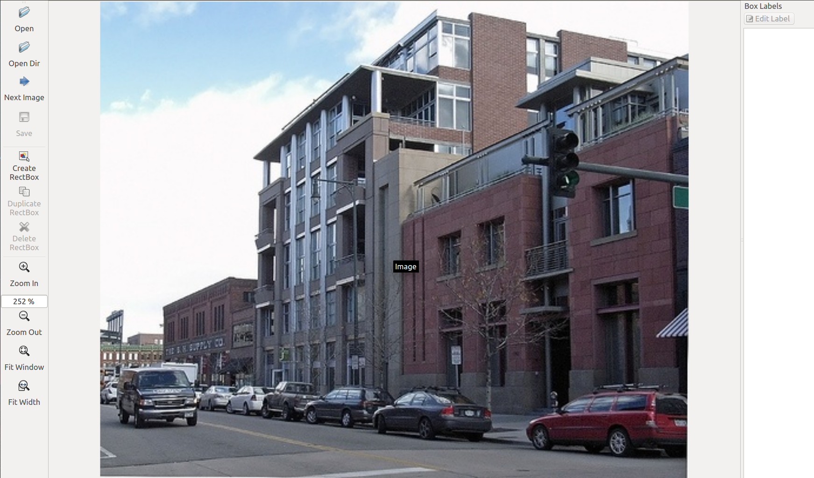

# ImageNet-Utils
Utils to help download images, crop bounding box, GUI tool to annotate image in XML file etc.

Grap the source

`$ git clone --recursive https://github.com/tzutalin/ImageNet_Utils.git`

### Requirements
If you would like to download the original images, you should signup [ImageNet](http://www.image-net.org/)

### Usage - Download images:
Get the urls of wnid and download all of them. E.g., download [Dog images from ImageNet](http://www.image-net.org/synset?wnid=n02084071) and save images to ./n02084071/url_images/*.jpg

`$ ./downloadutils.py --downloadImages --wnid n02084071`

Download all original images. E.g., download the original images about [person](http://www.image-net.org/synset?wnid=n00007846) and save to ./n00007846/n00007846_original_images/*.JPEG

`$ ./downloadutils.py --downloadOriginalImages --wnid n00007846`

Download the boundingbox xml of wnid. E.g., download  bounding boxes of original images about [person](http://www.image-net.org/synset?wnid=n00007846)

`$ ./downloadutils.py --downloadBoundingBox --wnid n00007846`

### Usage - Label images into text files:
Utils to create train.txt, val.txt, and test.txt

Format: [FilePath] [id]

Use the bellow cmd, and you can get image path and its label in train.txt and test.txt

`$ ./labelcreator.py --size_of_train 1400 --size_of_test 200  --label 11 --dir ./car`

Auto assign a label to each folder containing images under the dir. Create train.txt, val.txt, and test.txt. Size is 1200, 300, and 300

`$ ./labelcreator.py --size_of_train 1200 --size_of_val 300 --size_of_test 300`

### Usage - Crop the image by annotation XML:
Search the specified image according to its boudingbox's xml, so-called annotation file. If found, it will crop and save as ./boundingbox/*.JPEG

`$ ./bbox_helper.py --save_boundingbox --bxmlpath n00007846/Annotation/n00007846/n00007846_23985.xml `

Output:

    ./n00007846/n00007846_original_images/n00007846_23985.JPEG

    [[227, 25, 323, 91]]
    save to n00007846/bounding_box_imgs/n00007846_23985_box1.JPEG

Specify a directory and crop the images according its annotation file

`$ ./bbox_helper.py --save_boundingbox --bxmldir n00007846/`

Output:

    ./n00007846/n00007846_original_images/n00007846_35737.JPEG
    [[46, 99, 165, 290]]
    save to n00007846/bounding_box_imgs/n00007846_35737_box1.JPEG
    ./n00007846/n00007846_original_images/n00007846_132010.JPEG
    [[101, 57, 330, 497]]
    save to n00007846/bounding_box_imgs/n00007846_132010_box1.JPEG
    ./n00007846/n00007846_original_images/n00007846_158081.JPEG
    [[55, 85, 249, 498]]
    .....

### Usage - Use a GUI tool to create a annotation XML:

`$ git submodule init`

`$ git submodule update --recursive`

`$ sudo apt-get install pyqt4-dev-tools`

`$ cd labelImgGUI`

`$ make all`

`$ ./labelImg.py`

More Info:
 [labelImg](https://github.com/tzutalin/labelImg)

 [Video demo](https://www.youtube.com/watch?v=p0nR2YsCY_U)

### Usage - Convert Pascal Bounding Boxes to Dlib format:
Script to convert bounding boxes in Pascal format (e.g., demo/pascalBoxes/) to bounding boxes in Dlib format (e.g., demo/dlibDetBoxes.xml).

`./boxesCvtPascaltoDlib.py <path/to/pascal/boxes> <path/to/img/folder> --out out.xml`

### LICENSE
Copyright (C) <2015-2016> TzuTa Lin and Will Kao

Permission is hereby granted, free of charge, to any person obtaining a copy of this software and associated documentation files (the "Software"), to deal in the Software without restriction, including without limitation the rights to use, copy, modify, merge, publish, distribute, sublicense, and/or sell copies of the Software, and to permit persons to whom the Software is furnished to do so, subject to the following conditions:

The above copyright notice and this permission notice shall be included in all copies or substantial portions of the Software.

THE SOFTWARE IS PROVIDED "AS IS", WITHOUT WARRANTY OF ANY KIND, EXPRESS OR IMPLIED, INCLUDING BUT NOT LIMITED TO THE WARRANTIES OF MERCHANTABILITY, FITNESS FOR A PARTICULAR PURPOSE AND NONINFRINGEMENT. IN NO EVENT SHALL THE AUTHORS OR COPYRIGHT HOLDERS BE LIABLE FOR ANY CLAIM, DAMAGES OR OTHER LIABILITY, WHETHER IN AN ACTION OF CONTRACT, TORT OR OTHERWISE, ARISING FROM, OUT OF OR IN CONNECTION WITH THE SOFTWARE OR THE USE OR OTHER DEALINGS IN THE SOFTWARE.
